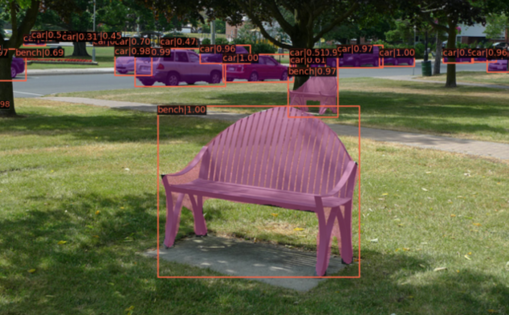
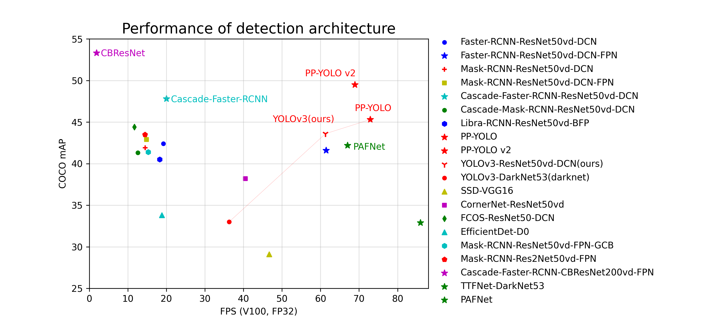

# **paddle-inference-deploy-Lib**
🔥 Best Deployment Tools for [paddleDetection](https://github.com/PaddlePaddle/PaddleDetection) and [paddleSeg](https://github.com/PaddlePaddle/PaddleSeg). 


This repository is a **universal deployment paradigm** of paddleDetection and paddleSeg. All the models export by these two Toolkits were compatible in `paddle-inference-deploy-Lib`.

## Semantic Segmentation

<div  align="center">
  
</div>

## Object Detection
<div  align="center">
  
</div>


## **Install Dependence**

- `PaddlePaddle`(>=2.2.0)

Install the PaddlePaddle 2.1 version, please refer to [Quick Installation](https://www.paddlepaddle.org.cn/install/quick?docurl=/documentation/docs/zh/install/pip/linux-pip.html) for the specific installation method. 

- `Paddleseg`

```
pip install paddleseg
```

## **Usage**

There are two local example models in `./model`. You can run it directly.

### (1) Run PaddleSeg Deployment
```bash
python paddleSegDemo.py 
```

### (2) Run PaddleDet Deployment
```bash
python paddleDetDemo.py 
```

##  **Overview of Kit Compatibale Structures**

<table align="center">
  <tbody>
    <tr align="center" valign="bottom">
      <td>
        <b>Object Detection</b>
      </td>
      <td>
        <b>Semantic Segmentation</b>
      </td>
    </tr>
    <tr valign="top">
      <td>
        <ul>
            <li>Faster RCNN</li>
            <li>FPN</li>
            <li>Cascade-RCNN</li>
            <li>Libra RCNN</li>
            <li>Hybrid Task RCNN</li>
            <li>PSS-Det</li>
            <li>RetinaNet</li>
            <li>YOLOv3</li>
            <li>YOLOv4</li>  
            <li>PP-YOLOv1/v2</li>
            <li>PP-YOLO-Tiny</li>
            <li>SSD</li>
            <li>CornerNet-Squeeze</li>
            <li>FCOS</li>  
            <li>TTFNet</li>
            <li>PP-PicoDet</li>
            <li>DETR</li>
            <li>Deformable DETR</li>
            <li>Swin Transformer</li>
            <li>Sparse RCNN</li>
      </ul>
      </td>
      <td>
        <ul>
                    <li>ANN</li>
            <li>BiSeNetV2</li>
            <li>DANet</li>
            <li>DeepLabV3</li>
            <li>DeepLabV3P</li>
            <li>Fast-SCNN</li>
            <li>HRNet-FCN</li>
            <li>GCNet</li>
            <li>GSCNN</li>
            <li>HarDNet</li>
            <li>OCRNet</li>
            <li>PSPNet</li>
            <li>U-Net</li>
            <li>U<sup>2</sup>-Net</li>
            <li>Att U-Net</li>
            <li>U-Net++</li>
            <li>U-Net3+</li>
            <li>DecoupledSeg</li>
            <li>EMANet</li>
            <li>ISANet</li>
            <li>DNLNet</li>
            <li>SFNet</li>
            <li>PP-HumanSeg</li>
            <li>PortraitNet</li>
            <li>STDC</li>
            <li>GINet</li>
            <li>PointRend</li>
            <li>SegNet</li>
            <li>ESPNetV2</li>
            <li>HRNet-Contrast</li>
            <li>DMNet</li>
            <li>ESPNetV1</li>
            <li>ENCNet</li>
            <li>PFPNNet</li>
            <li>FastFCN</li>
            <li>BiSeNetV1</li>
            <li>SETR</li>
            <li>MLA Transformer</li>
            <li>SegFormer</li>
            <li>SegMenter</li>
        </ul>
      </td>
    </tr>

</td>
    </tr>
  </tbody>
</table>


## **Model Zoo**

### Detection Model

The relationship between COCO mAP and FPS on Tesla V100 of Detection representative models of each server side architectures and backbones.

<div align="center">
  
</div>


### Segmentation Model

The relationship between mIoU and FLOPs of representative Segmentation architectures and backbones. See [Model Zoo Overview](./docs/model_zoo_overview.md) for more details.

<div align="center">
  
</div>


## **Future Work**

Star this repository will 	
encourage me to add new features such as `quick C++ deployment Lib` for the ToolKit.


- `C++ PaddleDet Lib`
- `C++ PaddleSeg Lib`
